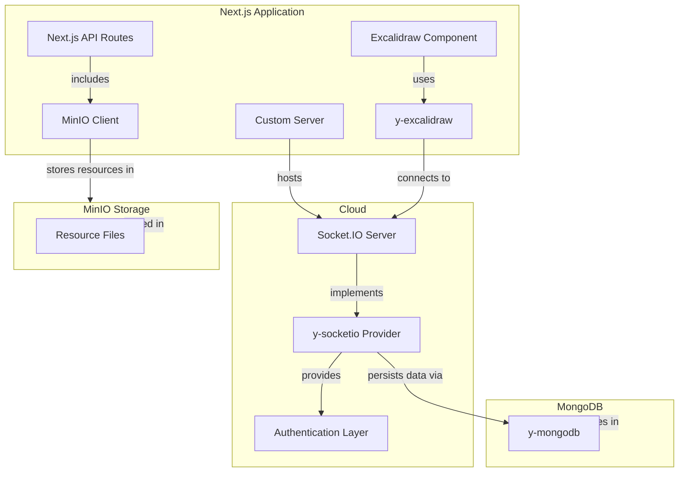

# Excalidraw YJS Starter

[English](./README.md) | [中文](./README.zh-CN.md)

### Introduction

This is a minimalist starter project for locally deploying Excalidraw based on Next.js, YJS, and Socket.IO. Through YJS, it enables real-time collaboration and data storage. The system uses MinIO client for resource file storage and MongoDB for data persistence.

### Online Demo

To experience a version based on local IndexedDB and tab-to-tab collaboration, please visit: https://excalidraw-yjs-starter.vercel.app/

**Note:** Due to Vercel limitations, the `/:id` route will not support real-time collaboration in the online demo. However, you can still enable local storage by adding `?indexeddb=true` to the URL.

### System Architecture



### Project Structure

- **Server-side YJS configuration**: Located in `src/server/collab.ts`
- **Client-side YJS configuration**: Located in `src/excalidraw/collab.ts`
- **Editor configuration**: Located in `src/excalidraw/index.tsx`
- **Resource management**: Located in `src/excalidraw/store.ts`

### Routing

- **Default route (`/`)**: Uses local IndexedDB with WebRTC for saving and collaboration between pages
- **ID-based route (`/:id`)**: Uses WebSocket for collaboration between clients with the same ID
  - To also save to local IndexedDB, add `?indexeddb=true` to the URL query parameters

### Installation

```bash
# Due to issues with y-excalidraw, you need to use the --force flag
npm install --force
# or
yarn install --force
```

### Local Development

```bash
npm run dev
# or
yarn dev
```

Open [http://localhost:3000](http://localhost:3000) with your browser to see the result.

### Production Deployment

#### Build and Run

```bash
# Build the project
npm run build
# or
yarn build

# Start the server
cd dist
node server.js
```

#### Using Docker

```bash
# Build the Docker image
docker build -t excalidraw-yjs .

# Run the container
docker run -p 3000:3000 excalidraw-yjs

# Or using Docker Compose
docker-compose up -d
```

### Extending Functionality

If you need to extend the YJS and Socket.IO server capabilities, please refer to the documentation for [y-socket.io](https://github.com/ivan-topp/y-socket.io) and [y-excalidraw](https://github.com/excalidraw/y-excalidraw), or download the source code and modify it according to your needs.

#### Authentication and Persistence

The system architecture allows for implementing authentication on the Socket.IO server. For data persistence, we recommend using [y-mongodb](https://github.com/yjs/y-mongodb) to store collaborative data in MongoDB.

#### Resource Storage

Resource files (images, attachments, etc.) are stored using MinIO, which is an S3-compatible object storage. The Next.js API includes a MinIO client for handling resource uploads and retrievals.

### Acknowledgements

Special thanks to the authors of:

- [y-socket.io](https://github.com/ivan-topp/y-socket.io) - Ivan Topp and contributors
- [y-excalidraw](https://github.com/RahulBadenkal/y-excalidraw) - Rahul Badenkal and contributors
