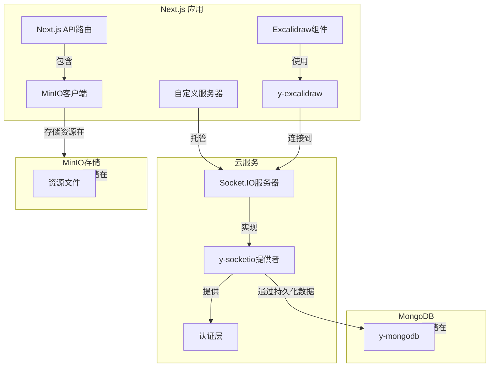

# Excalidraw YJS 启动项目

[English](./README.md) | [中文](./README.zh-CN.md)

## 简介

这是一个精简的基于Next.js、YJS和Socket.IO的本地部署Excalidraw的启动项目。通过YJS，对数据进行协同以及存储。系统使用MinIO客户端进行资源文件存储，并使用MongoDB进行数据持久化。

## 在线演示

如果想要体验一下基于本地indexeddb和tab间协同的版本的话，请访问：https://excalidraw-yjs-starter.vercel.app/

**注意：**由于Vercel的限制，在线演示中 `/:id` 路由将无法使用实时协同功能。但是，您仍然可以通过在URL中添加 `?indexeddb=true` 来启用本地存储。

## 系统架构



## 项目结构

- **服务器端YJS配置**：位于`src/server/collab.ts`
- **客户端YJS配置**：位于`src/excalidraw/collab.ts`
- **编辑器配置**：位于`src/excalidraw/index.tsx`
- **资源管理**：位于`src/excalidraw/store.ts`

## 路由说明

- **默认路由 (`/`)**：使用本地IndexedDB配合WebRTC在页面间保存和协同
- **ID路由 (`/:id`)**：使用WebSocket在同一个ID下的客户端之间进行协同
  - 如果需要同时保存到本地IndexedDB，需要在URL查询参数中添加`?indexeddb=true`

## 安装

```bash
# 由于y-excalidraw的问题，安装需要增加--force指令
npm install --force
# 或
yarn install --force
```

## 本地开发

```bash
npm run dev
# 或
yarn dev
```

在浏览器中打开 [http://localhost:3000](http://localhost:3000) 查看结果。

## 生产部署

### 构建和运行

```bash
# 构建项目
npm run build
# 或
yarn build

# 启动服务器
cd dist
node server.js
```

### 使用Docker

```bash
# 构建Docker镜像
docker build -t excalidraw-yjs .

# 运行容器
docker run -p 3000:3000 excalidraw-yjs

# 或使用Docker Compose
docker-compose up -d
```

## 扩展功能

如果需要扩展YJS和Socket.IO服务器的相关能力，请查阅[y-socket.io](https://github.com/ivan-topp/y-socket.io)和[y-excalidraw](https://github.com/excalidraw/y-excalidraw)这两个项目的相关文档，或者下载对应源码后进行修改。

### 认证和持久化

系统架构允许在Socket.IO服务器上实现认证。对于数据持久化，我们推荐使用[y-mongodb](https://github.com/yjs/y-mongodb)将协作数据存储在MongoDB中。

### 资源存储

资源文件（图片、附件等）使用MinIO存储，这是一个兼容S3的对象存储服务。Next.js API包含一个MinIO客户端，用于处理资源上传和检索。

## 致谢

特别感谢以下项目的作者：

- [y-socket.io](https://github.com/ivan-topp/y-socket.io) - Ivan Topp及贡献者
- [y-excalidraw](https://github.com/RahulBadenkal/y-excalidraw) - Rahul Badenkal及贡献者
